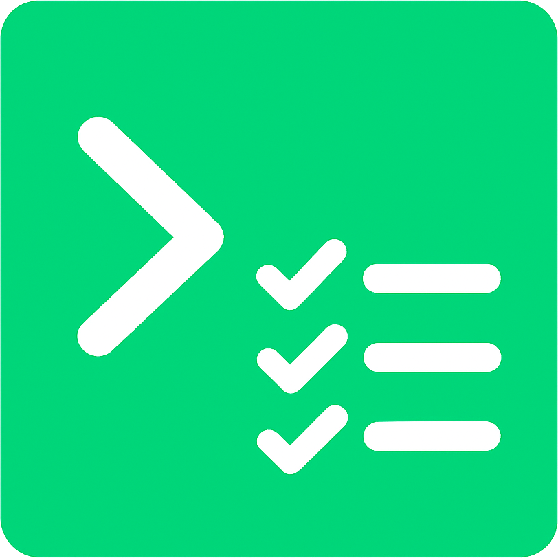

  

<h1 align="center">
  Keep Command
</h1>

  Keep commands structured, searchable, and stress-free.  
  Organize. Recall. Execute. The simplest way to manage your commands.

  
  
  
  

  

### What is Keep Command?

Keep Command is a simple command manager that allows you to create and manage commands in a structured way.  

- No need to **memorize** commands
- Easy to **search** and **filter** commands
- Easy to **copy** and **paste** commands

## Key Features
- Works on **Windows** and **macOS**
- Folder creation
- Command creation inside of folders
- Folder and command tagging
- Folder search by name, tags and also by name and tags of commands inside
- Command search by name, tags and the `command` itself
- One click to **copy** and **paste** commands

## Get Started

Download the app from [Releases section](https://github.com/AlbertArakelyan/keep-command/releases/latest) and start organizing your commands.

## Support

Have any questions ❓ feel free to reach out me 🙂.  
Soon we will have our community chat on **Discord**.

## Contributing

- If you find a bug or have an idea for a new feature, please [open an issue](https://github.com/AlbertArakelyan/keep-command/issues).
- If you want to contribute, feel free to [fork the repository](https://github.com/AlbertArakelyan/keep-command) and create a pull request.

## License

Licensed under the [Apache License, Version 2.0](https://github.com/AlbertArakelyan/keep-command/blob/main/LICENSE).
